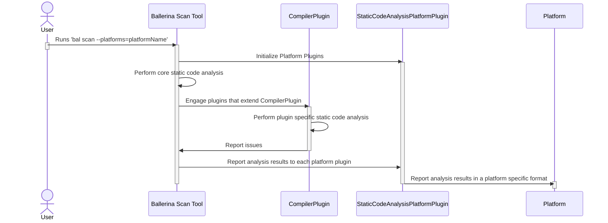

# Ballerina Static Code Analyzer

Welcome to the Ballerina static code analysis tool documentation. This section contains,

1. How the Ballerina static code analysis tool works and its features.
2. How to extend the analysis functionalities of the static code analysis tool.
3. How to extend reporting analysis results to static analysis platforms.

These documentations are intended for the developers who wish to understand the internals of the Ballerina static code analysis tool and for developers who are planning to extend features of the tool.

# Contents

- [Overview](#overview)
- [Features](#features)
- [Extending Static Code Analysis Tool's Behavior](#extending-static-code-analysis-tools-behavior)
  - [Compiler Plugins](#compiler-plugins)
  - [Platform Plugins](#platform-plugins)
- [References](#references)

# Overview



The Ballerina static code analysis tool performs analysis on both single `BAL` files and Ballerina projects and identifies potential code smells, bugs, and vulnerabilities without executing them.

The tool performs the analysis against a core set of rules based on the core language. If compiler plugins that perform additional static analysis are available, the tool will engage them and finally report the analysis results to static analysis platforms via platform plugins.

# Features

1. Run analysis against all Ballerina documents in a Ballerina project.

```bash
bal scan
```

2. Run analysis against a standalone Ballerina file. The file path can be relative or absolute.

```bash
bal scan main.bal
```

> Note: Analyzing individual Ballerina files of a package is not allowed.

3. Run analysis and save analysis results in a specified directory.

```bash
bal scan --target-dir="results"
```

4. Run analysis and generate a HTML analysis report.

```bash
bal scan --scan-report
```

5. Run analysis and specify the output format (ballerina or sarif).

```bash
bal scan --format=sarif
```

> Note: The default format is ballerina. The tool supports both ballerina and sarif formats for analysis results.

6. View all available rules.

```bash
bal scan --list-rules
```

7. Run analysis for a specific rule.

```bash
bal scan --include-rules="ballerina:101"
```

8. Run analysis for a specific set of rules.

```bash
bal scan --include-rules="ballerina:101, ballerina/io:101"
```

9. Exclude analysis for a specific rule.

```bash
bal scan --exclude-rules="ballerina:101"
```

10. Exclude analysis for a specific set of rules.

```bash
bal scan --exclude-rules="ballerina:101, ballerina/io:101"
```

11. Run analysis and report to a static analysis platform (e.g., SonarQube).

```bash
bal scan --platforms=sonarqube
```

> Note: If the Platform Plugin path is not provided in a `Scan.toml` file, the tool will attempt to download the Platform Plugin for plugins developed by the Ballerina team.

12. Run analysis and report to multiple static analysis platforms.

```bash
bal scan --platforms="sonarqube, semgrep, codeql"
```

13. Configuring the tool's behavior using a configuration file. (e.g., `Scan.toml`)

```md
📦ballerina_project
 ┣ 📜.devcontainer.json
 ┣ 📜.gitignore
 ┣ 📜Ballerina.toml
 ┣ 📜main.bal
 ┗ 📜Scan.toml
```

For more information on setting up a configuration file, refer to [Scan File Configurations](ScanFileConfigurations.md).

# Extending Static Code Analysis Tool's Behavior

The Ballerina Static Code Analysis tool provides the following methods to extend its behavior,

- Compiler Plugins - plugins that extend the `CompilerPlugin` class can introduce custom rules.
- Platform Plugins - plugins that extend the `StaticCodeAnalysisPlatformPlugin` interface can report analysis results to static analysis platforms.

> Note: Library modules will also implement compiler plugins to introduce library-specific rules. This enables library developers to independently develop and maintain rules applicable to their modules.

## Compiler Plugins

Analysis and reporting of additional issues can be done by implementing plugins that extend the Ballerina `CompilerPlugin` class.

This will be used by,

- Ballerina platform library developers (e.g., ballerina/http, ballerinax/twilio, etc.).
- External users who want to introduce and share custom rules.

As compiler plugins are Ballerina packages, users and organizations can make them available via Ballerina Central.

For more information on performing additional analysis and reporting issues, refer to creating a [Static Code Analyzer Compiler Plugin.](StaticCodeAnalyzerCompilerPlugin.md)

## Platform Plugins

For reporting analysis results to static code analysis platforms, the `StaticCodeAnalysisPlatformPlugin` interface can be implemented.

```java
package io.ballerina.scan;

public interface StaticCodeAnalysisPlatformPlugin {
   String platform();
   void init(PlatformPluginContext platformPluginContext);
   void onScan(List<Issue> issues);
}
```

The scan tool will initialize each platform plugin by calling their `init` method. It uses the `platform` method to identify the platform plugin to pass platform-specific arguments, provided by the user (specified via CLI or '`Scan.toml`'), via the platform plugin context during initialization. After completing the scans, the tool will invoke the Platform Plugins' `onScan` method to notify identified issues. The plugin can then report issues to the relevant platform in the expected format.

For more information on reporting analysis results to static analysis platforms, refer to creating a [Static Code Analysis Platform Plugin.](StaticCodeAnalysisPlatformPlugin.md)

# References

- [Static Code Analysis Support for Ballerina](https://docs.google.com/document/d/1J9Un9zJ05ISLnO1x1olhBqEjmMXqzcfzHnUPoyWwKXQ/edit?usp=sharing)
- [Ballerina Scan Tool](https://docs.google.com/document/d/1l_XvRGPaTJ7YOnn-HQ07erjJQDKjilFRE_mtyga3C-I/edit?usp=sharing)