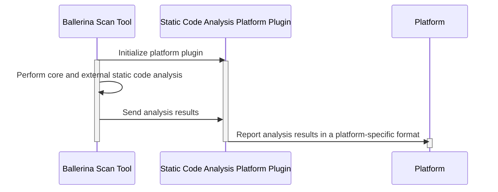

# Static Code Analysis Platform Plugin

# Contents

- [What is a Static Code Analysis Platform Plugin?](#what-is-a-static-code-analysis-platform-plugin)
- [Steps to create and report analysis results to a platform from a Static Code Analysis Platform Plugin](#steps-to-create-and-report-analysis-results-to-a-platform-from-a-static-code-analysis-platform-plugin)
- [References](#references)

# What is a Static Code Analysis Platform Plugin?



A Static Code Analysis Platform Plugin is an implementation of the `StaticCodeAnalysisPlatformPlugin` that allows the static code analysis tool to pass analysis results to a specific static code analysis platform. 

To report analysis issues to a specific platform, the user has to specify the details of the platform plugin in a `Scan.toml` file.

```toml
[[platforms]]
name = "platformName"
path = "path/to/platform/plugin"
```

Once the user defines `StaticCodeAnalysisPlatformPlugin`'s in the `Scan.toml` file, and executes `bal scan`, the static code analysis tool will first initialize the platform plugins. If additional properties are defined under each platform in the configuration file, they will be passed to the platform plugin during this stage. Then, after performing the core and external static code analysis, the tool will send the analysis results to the platform plugins. The platform plugins will then report the analysis results in a platform-specific format to the platforms.

# Steps to create and report analysis results to a platform from a Static Code Analysis Platform Plugin

1. Implement the `StaticCodeAnalysisPlatformPlugin` interface and build the platform plugin.

```java
package io.ballerina.scan.platform;

public class PlatformPlugin implements ScannerPlatformPlugin {
   @Override
   public String platform() {
       return "platformName";
   }

   @Override
   public void init(PlatformPluginContext platformPluginContext) {
   }

   @Override
   public void onScan(List<Issue> issues) {
   }
}
```

The `ScannerPlatformPlugin` interface has provides the following methods:

- `platform()` - Returns the name of the platform.
- `init(PlatformPluginContext platformPluginContext)` - Initializes the platform plugin with configurations from the `PlatformPluginContext`.
- `onScan(List<Issue> issues)` - Pass analysis results to the platform plugin.

The `PlatformPluginContext` consists of platform-specific configurations that are passed to the platform plugin during initialization.

```java
public interface PlatformPluginContext{
   Map<String, String> platformArgs();
   boolean initiatedByPlatform();
}
```

It has the following methods:

- `platformArgs()` - Returns in-memory representation of the platform-specific arguments defined in the `Scan.toml` file.
- `initiatedByPlatform()` - Returns true if the analysis is triggered by the platform side and false if it is triggered by the static code analysis tool.

2. Define the path to the platform plugin in the `Scan.toml` file.

```toml
[[platforms]]
name = "platformName"
path = "path/to/platform/plugin"
```

> Note: The name provided in the `Scan.toml` file should match the platform name returned by the `platform()` method in the platform plugin.

3. Trigger an analysis using the static code analysis tool.

```bash
bal scan
```

# References

- [SonarQube Support for Ballerina](https://docs.google.com/document/d/1AJYNN5fv9MU0UT9WKbFKc44THnhiBJhQY_cHRn6iXto/edit?usp=sharing)