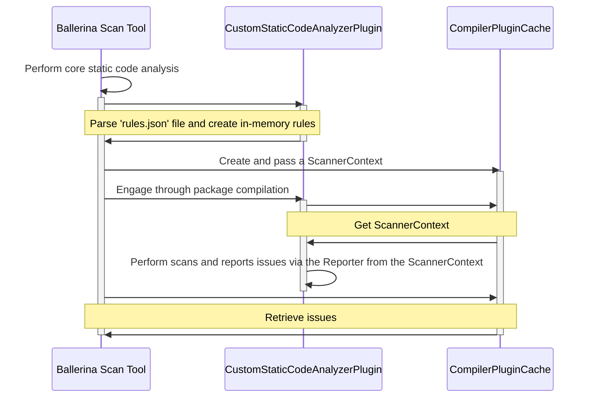

# Static Code Analyzer Compiler Plugin

# Contents

- [What is a static code analyzer compiler plugin?](#what-is-a-static-code-analyzer-compiler-plugin)
- [Components of the Static Code Analyzer Compiler Plugin](#components-of-the-static-code-analyzer-compiler-plugin)
  - [`Rule` interface](#rule-interface)
  - [`RuleFactory` class](#rulefactory-class)
  - [`ScannerContext` interface](#scannercontext-interface)
  - [`Reporter` interface](#reporter-interface)
- [Steps to create a Static Code Analyzer Compiler Plugin](#steps-to-create-a-static-code-analyzer-compiler-plugin)
  - [Step 1: Defining the static code analysis rules](#step-1-defining-the-static-code-analysis-rules)
  - [Step 2: Implementing the compiler plugin classes to perform static code analysis](#step-2-implementing-the-compiler-plugin-classes-to-perform-static-code-analysis)
- [References](#references)

# What is a static code analyzer compiler plugin?



A static code analyzer compiler plugin is a Ballerina `CompilerPlugin` that allows extending the static code analysis features of the Ballerina scan tool.

To perform additional analysis, the user has to specify the details of the compiler plugin in a `Scan.toml` file.

```toml
[[analyzer]]
org = "arc"
name = "custom_static_code_analyzer"
```

Once the user defines `CompilerPlugin`'s in the `Scan.toml` file, and executes `bal scan`, core scans will be performed first. Then the tool generates the `CompilerPlugin`'s defined in the `Scan.toml` file as imports to an in-memory Ballerina file in the default module. Next the tool retrieves and parses the `rules.json`  file of the `CompilerPlugin`'s and creates a `ScannerContext`. The tool passes the created `ScannerContext`'s to the `CompilerPluginCache` and engages the compiler plugins through package compilation. The engaged `CompilerPlugin`'s perform additional static analysis and reports issues via the `Reporter`'s retrieved from the `ScannerContext`'s. Finally, the tool retrieves the reported issues and saves them to a report file.

# Components of the Static Code Analyzer Compiler Plugin

The static code analysis tool provides the following components to support additional static code analysis via compiler plugins:

- `Rule` interface.
- `RuleFactory` class.
- `ScannerContext` interface.
- `Reporter` interface.

## `Rule` interface

```java
package io.ballerina.scan;

public interface Rule {
   String id();
   int numericId();
   String description();
   RuleKind kind();
}
```

The `Rule` interface consists of the following methods:

- `id()` - Returns the fully qualified identifier of the rule.
- `numericId()` - Returns the numeric identifier of the rule.
- `description()` - Returns the description of the rule.
- `kind()` - Returns the `RuleKind` of the rule.

The `RuleKind` is an enum that represents the type of the rule.

```java
package io.ballerina.scan;

public enum RuleKind {
   CODE_SMELL,
   BUG,
   VULNERABILITY
}
```

It consists of the following types:

- `CODE_SMELL` - Rules related to code maintainability.
- `BUG` - Rules related to coding mistakes that cause errors or unexpected behaviour at runtime.
- `VULNERABILITY` - Rules related to code susceptible to exploits due to security weaknesses.

## `RuleFactory` class

```java
package io.ballerina.scan;

class RuleFactory {
   private RuleFactory() {}
    
   static Rule createRule(int numericId, String description, RuleKind ruleKind, String org, String name) {
       // Create rule with fully qualified identifier
       // ...
   }
}
```

When the `createRule` method of the `RulesFactory` is called by the static code analysis tool, it combines the organization and package names of the compiler plugin with the rules’ numeric identifier to create a `Rule` with a unique fully qualified identifier.

## `ScannerContext` interface

```java
package io.ballerina.scan;

public interface ScannerContext {
   Reporter getReporter();
}
```

When the `getReporter` method of the `ScannerContext` is called by the static code analyzer compiler plugin, it returns the `Reporter` interface that allows reporting static analysis issues.

The static code analysis tool creates a new scanner context that contains the in-memory rules for each static code analyzer plugin for reporting issues.

## `Reporter` interface

```java
package io.ballerina.scan;

public interface Reporter {
   void reportIssue(Document reportedDocument, Location location, int ruleId);

   void reportIssue(Document reportedDocument, Location location, Rule rule);
}
```

It consists of the following methods:

- `reportIssue(Document, Location, int)` - allows reporting static analysis issues by accepting the numeric identifier of a rule.
- `reportIssue(Document, Location, Rule)` - allows reporting static analysis issues by accepting a programmatically created rule.

The reporters’ `reportIssue` method accepts the numeric identifier of a rule, matches it to the fully qualified identifier of the corresponding in-memory rule, and reports the `Issue` associated with that rule. 

An `Issue` is the in-memory representation of a static code analysis issue reported by the `Reporter`.

```java

package io.ballerina.scan;

public interface Issue {
    Location location();
    Rule rule();
    Source source();
}
```

It consists of the following methods:

- `location()` - Returns the [Location](https://github.com/ballerina-platform/ballerina-lang/blob/fcab497029f10a9424fa7c26f9592248d57843ee/compiler/ballerina-tools-api/src/main/java/io/ballerina/tools/diagnostics/Location.java) of the issue.
- `rule()` - Returns the `Rule` associated with the issue.
- `source()` - Returns the `Source` of the issue.

The `Source` interface represents the source of the issue.

```java
package io.ballerina.scan;

public enum Source {
    BUILT_IN,
    EXTERNAL
}
```

It consists of the following types:

- `BUILT_IN` - Label for marking issues reported by the static code analysis tool and Ballerina platform static code analyzer plugins.
- `EXTERNAL` - Label for marking issues reported by non-Ballerina platform static code analyzer plugins.

# Steps to create a Static Code Analyzer Compiler Plugin

There are two steps to follow to create a static code analyzer compiler plugin:

- Defining the static code analysis rules.
- Implementing the compiler plugin classes to perform static code analysis.

## Step 1: Defining the static code analysis rules

Create a `rules.json` file in the resources directory with static analysis rules defined in the following format:

```json
[
  {
    "id": 1,
    "ruleKind": "CODE_SMELL",
    "description": "rule 1"
  },
  {
    "id": 2,
    "ruleKind": "BUG",
    "description": "rule 2"
  },
  {
    "id": 3,
    "ruleKind": "VULNERABILITY",
    "description": "rule 3"
  }
]
```

Each static code analysis rule consists of three parts:

- `id` - Integer numeric identifier of the rule.
- `ruleKind` - Can be one of the following types:
  - CODE_SMELL
  - BUG
  - VULNERABILITY
- `description` - Description of the rule.

## Step 2: Implementing the compiler plugin classes to perform static code analysis

- Create a plugin class that extends the `CompilerPlugin` class, and passes the `ScannerContext` retrieved from the `CompilerPluginContext`:

```java
package org.arc.scanner;

public class CustomStaticCodeAnalyzer extends CompilerPlugin {
   @Override
   public void init(CompilerPluginContext compilerPluginContext) {
      Object context = compilerPluginContext.userData().get("ScannerContext");
      
      // Passing the ScannerContext through a conditional block to avoid class loading exceptions
      if (context != null) {
         ScannerContext scannerContext = (ScannerContext) context;
         compilerPluginContext.addCodeAnalyzer(new CustomCodeAnalyzer(scannerContext));
      }
   }
}
```

> Note: compiler plugins of Ballerina modules should wrap the logic to retrieve and pass the `ScannerContext` in a conditional block to avoid potential class loading exceptions when running them with distribution packed commands like `bal run`.

- Create an analyzer class that extends the `CodeAnalyzer` class, and passes the `ScannerContext` to an analysis task:

```java
package org.arc.scanner;

public class CustomCodeAnalyzer extends CodeAnalyzer {
  private final ScannerContext scannerContext;

  public CustomCodeAnalyzer(ScannerContext scannerContext) {
    this.scannerContext = scannerContext;
  }

  @Override
  public void init(CodeAnalysisContext codeAnalysisContext) {
    codeAnalysisContext.addSyntaxNodeAnalysisTask(new CustomAnalysisTask(scannerContext), SyntaxKind.FUNCTION_BODY_BLOCK);
  }
}
```

- Create an analysis task class that extends the `SyntaxNodeAnalysisTask` class, and performs static code analysis:

```java
package org.arc.scanner;

public class CustomAnalysisTask implements AnalysisTask<SyntaxNodeAnalysisContext> {
   private final Reporter reporter;

   public CustomAnalysisTask(ScannerContext scannerContext) {
      this.reporter = scannerContext.getReporter();
   }

   @Override
   public void perform(SyntaxNodeAnalysisContext context) {
      Module module = context.currentPackage().module(context.moduleId());
      Document document = module.document(context.documentId());
      FunctionBodyBlockNode functionBodyBlockNode = (FunctionBodyBlockNode) context.node();

      // Perform analysis
      // ...

      reporter.reportIssue(document, functionBodyBlockNode.location(), 1);
   }
}
```

# References

- [Static Code Analyzer Compiler Plugin](https://docs.google.com/document/d/1yybxymfb2wWQEf2eOgTmIg6ebjY8mFSpElu37hL5lAQ/edit?usp=sharing)